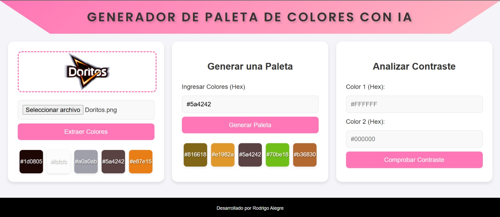

<h1 align="center"> Generador de Paletas de Colores </h1>

## Descripción.

Este proyecto es una aplicación web interactiva que permite a los usuarios subir imágenes, generar paletas de colores armoniosas y analizar el contraste entre los colores seleccionados. El modelo de inteligencia artificial
detrás de este proyecto usa algoritmos de agrupamiento para identificar colores clave y asegura una selección estética y funcional de tonos que cumplan estándares visuales.

## Características.

1. **Subir Imagen**: Permite cargar una imagen y extraer automáticamente los colores más relevantes.
2. **Generar Paleta**: Genera una paleta de colores que haga sinergia.
3. **Analizar Contraste**: Calcula el contraste entre dos colores según las normas de accesibilidad WCAG (Web Content Accessibility Guidelines).

## Inteligencia Artificial y Algoritmos.

El proyecto usa el argoritmo K-Means Clustering para analizar y extraer colores dominantes de imágenes y para generar paletas de colores.

1. **Extracción de Colores**:
   
   * La imagen se procesa para identificar los colores más frecuentes, eliminando ruido.
   * Se usa K-Means para agrupar colores similares y determinar los tonos predominantes.
  
2. **Generación de Paletas**:
   
   * Se toma un conjunto inicial de colores (en formato hexadecimal) proporcionado por el usuario.
   * K-Means se asegura que los colores generados sean diversos y armoniosos, evitando tonalidades demasiado similares.

3. **Análisis de Contraste**:
   
   * Se calcula la luminancia relativa de dos colores y se usa para determinar el contraste.
   * La fórmula sigue los estándares WCAG para evaluar la accesibilidad visual de los colores.

## Estructura del proyecto.

### Herramientas usadas.

* Flask: Framework de backend para manejar rutas y lógica de la aplicación.
* scikit-learn: Para implementar el algorítmo K-Means.
* Pillow: Para manejar imágenes y validar su formato.
* HTML, CSS y JavaScript: Para el frontend.

### Secciones principales.

1. **Subir Imagen**
   
   * **Función**: Permite al usuario cargar una imagen en cualquier formato compatible (como PNG o JPG).
     
   * **Poceso**:
     * Valida que el archivo sea una imagen válida.
     * Extrae colores dominantes de la imagen mediante el algoritmo K-Means.
       
   * **Resultado**: Muestra una vista previa de los colores extraídos.

2. **Generar Paleta**
   
   * **Función**: Genera una paleta de colores complementarios a partir de colores proporcionados.
     
   * **Proceso**:
     * Recibe un conjunto de colores en formato hexadecimal.
     * Genera colores diversos que hacen sinergia con colores iniciales.

   * **Resultado**: Una paleta visualmente agradable y funcional.
  
3. **Analizar Contraste**
   
   * **Función**: Evalúa el contraste entre dos colores.
  
   * **Proceso**:
     * Calcula la relación de contraste utilizando la fórmula de luminancia relativa.
     * Retorna un valor númerico que indica si el contraste cumple con los estándares WCAG.
    
   * **Resultado**: Muestra el ratio de contraste.
